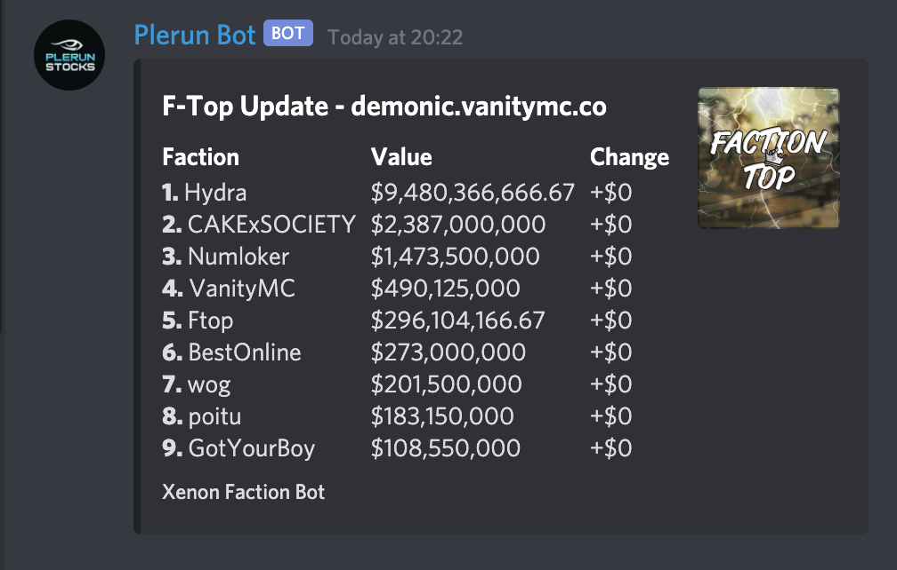

# Minecraft <-> Discord Factions Bot

A robust, full-featured Discord bot designed specifically for Minecraft Factions servers. Xenon connects Discord users to their in-game counterparts and provides powerful moderation, faction management, alerts, and automation tools.

---

This was originally developed as a private project intended for client distribution, which is why MongoDB-based authorization was implemented to control access.

## 📦 Features

### 🔗 **In-Game ↔ Discord Integration**
- Syncs Minecraft usernames to Discord users.
- Send in-game commands directly from Discord (`sudo`, `runcmd`, `rotate`).
- Link deposit/withdrawal alerts to Discord.
- View faction and player stats live from Minecraft (`ftop`, `ptop`, `fwho`, etc).

### 🧾 **Application System**
- Fully configurable recruitment flow via `setupquestions`, `apply`, `accept`, and `deny`.
- View application `status` directly on Discord.

### 🛠️ **Moderation & Utility Tools**
- Commands for `kick`, `ban`, `purge`, `say`, `embed`, `lock`, and `unlock`.
- Information tools like `serverinfo`, `botstats`, `listroles`, and `inrole`.
- Mathematical utilities (`calc`, `calculator`).
- Music playback via YouTube (`play`, `pause`, `loop`).

### 📊 **Faction Leaderboards & Stats**
- `playtime`, `deposit`, `playtop`, `dtop` for player contribution tracking.
- `walls`, `buffers`, `rposttop`, `ctop`, `btop` for checker activity.
- Live `ftop`, `ptop`, and `baltop` integration.
- Vanish tracker that allowed players to bypass server plugins that hid staff members ingame (`vanish`)

### 🚨 **Alerts & Detectors**
- TNT, player, and creeper proximity alerts (with coordinates).
- Auto claim, bank, and player count tracking via regex matchers.
- `kill logs` track PvP deaths using customizable regex.

### 🧪 **Checks & Raiding Tools**
- Wall/buffer clearing (`clear`, `bclear`), `weewoo` raid alerts.
- Outpost/KOTH support via `routpost`, `koth`, `outpost`.

### ⚙️ **Fully Configurable**
- YAML-driven config system: bot settings, role/channel IDs, regex formats, toggles.
- Built-in `settings` command for real-time updates to config via Discord.
- Optional modules can be enabled/disabled per feature: `walls`, `bank`, `music`, etc.

---

### Preview

F-Top Command - Retrieves ingame leaderboard and formats

---

### Prerequisites
- Node.js (v12+ recommended)
- Discord.JS (v12)
- MongoDB (used for auth logging)
- FFmpeg (required for music playback)
- A verified Minecraft account (for the bot)